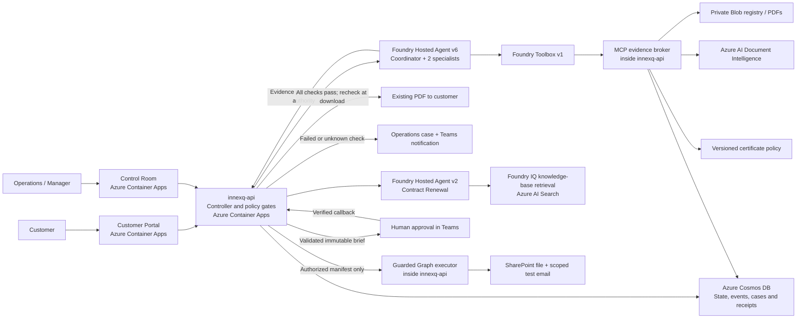

# InnexQ

### Enterprise agents that turn requests into governed outcomes

InnexQ helps equipment-service customers get the documents they need and gives
Operations an evidence-backed case when a request cannot safely proceed.
It is a product-shaped MVP built around reusable Workflow Packs, not a one-off
renewal script or a chatbot with a knowledge base.

**Agents investigate and explain. Code validates. Authorization gates the outcome.**

Contract Renewal is the first Workflow Pack. Certificate Fulfilment adds a
customer-facing experience and a tool-using agent team. It releases only an
existing customer PDF under an explicit standing policy; commercial changes and
external renewal writes remain human-authorized.

## The customer-to-Operations journey

1. A customer signs into the **Customer Portal** and asks about equipment service
   or certificate status, or requests an existing certificate in ordinary language.
2. The customer confirms the interpreted request. Confirmation starts the checks;
   it is not permission to release a document.
3. A **Request Coordinator** invokes a **Document Analyst** and an
   **Equipment & Service specialist** to gather evidence through scoped tools.
4. Code checks **ownership, certificate validity and service status**.
5. If every check passes, the existing PDF is available. Eligibility and artifact
   integrity are checked again at download.
6. Otherwise, no PDF is released. A durable case reaches **Operations in Teams**
   and the **Control Room**, with the request, reasons, citations and verified
   tool activity where available.

Operations can acknowledge, add internal notes and close without release.
Managers inspect these certificate cases read-only. Case review cannot override
failed checks. Customer-facing progress does not expose internal notes.

## Implemented and demonstrated

Accepted deployment snapshot: **2026-09-20**. This is hackathon evidence, not
production-readiness certification or acceptance of the entire expansion roadmap.

| Capability | Evidence |
| --- | --- |
| Certificate team v6 | Coordinator and two specialists in one Foundry Hosted Agent deployment; real Foundry Toolbox/MCP evidence tools. |
| PT-001 certificate | All checks passed; download preparation persisted; owner confirmed customer success. |
| PT-002 certificate | Service not current; release held; Operations case and delivered notification. |
| PT-003 certificate | Missing evidence; release held; Operations case and delivered notification. |
| Portal and Control Room | Owner-confirmed customer/Operations access; held cases expose evidence and recorded tool receipts when present. |
| Contract Renewal v2 | Earlier three-consecutive-Run gate passed with real Teams approvals, approved SharePoint files and test emails. |
| Automated baseline | 1,029 tests: 764 API/domain, 158 agent, 104 UI and 3 web-server tests. |

Three consecutive v6 **evidence investigations** passed separately from the
customer pilot; they are not three complete customer certificate releases.
Closure updates were not separately retested in v6. Teams acceptance is not proof
someone read a message; mail acceptance is not proof of inbox delivery.

## Architecture at a glance



This is a logical overview, not a network-isolation diagram. Microsoft Entra ID
authenticates users/workloads; scoped identities separate agent/read access from
execution. Application Insights and Log Analytics support operational audit.

## Why the agents are more than a chat layer

- The coordinator invokes both specialists through the model/tool loop. Missing
  or failed branches stop safely.
- Document Analyst discovers permitted documents and invokes PDF analysis.
  Equipment & Service reads equipment records and approved policy.
- Four read-only tools run through Foundry Toolbox and the authenticated MCP
  broker: `list_equipment_documents`, `analyze_document`,
  `get_equipment_record`, `retrieve_policy`.
- Document Intelligence runs behind `analyze_document`. Receipts bind evidence
  to request, specialist and source version; code verifies them.
- Models do not perform financial arithmetic, mutate workflow state, authorize
  release, write SharePoint files or send email.

The certificate policy tool returns a fixed version/hash-bound policy, not
Foundry IQ. The separate renewal agent uses the approved Foundry IQ knowledge-base
REST adapter over Azure AI Search, plus a deterministic pricing/authority tool.
Its index has no vector configuration; that adapter is not a portal-attached MCP
knowledge connection.

## Security and authorization

- Entra token, tenant, actor and scope checks happen server-side. Customer identity
  binds to equipment; a prompt or email label cannot grant access.
- Agent-only MCP access also requires short-lived request/customer/tool scopes and
  call budgets. Models do not receive credentials or private scope handles.
- A separate certificate-reader managed identity reads private Blob/PDF sources
  and invokes OCR. The certificate agent has no direct Blob/OCR/Graph-write role.
- The controller owns transitions. The narrow existing-PDF policy does not
  authorize new certificates, commercial changes or arbitrary email.
- Renewal approvals bind the immutable brief/action-manifest hash. The guarded
  executor checks state, actor authority, allowlists and idempotency.
- SharePoint uses selected-site access. Mail uses mailbox-scoped Exchange
  application RBAC plus an application recipient allowlist.
- Cosmos persists audit/delivery state. Unknown external outcomes do not trigger
  blind retries. Automatic prompt/content capture is disabled by design; this
  is not platform-wide redaction certification.

Broker, controller and executor are logical components in one API process, not
separate deployed services. No VNet/private-endpoint isolation is claimed.
See [SECURITY.md](SECURITY.md).

## Technology

| Layer | Implementation |
| --- | --- |
| Experiences | React, TypeScript, Fluent UI; separate Customer Portal and Control Room Container Apps |
| Backend | Python 3.12, FastAPI, framework-independent Pydantic contracts |
| Agents | Microsoft Foundry Hosted Agents, Microsoft Agent Framework, Responses protocol; configured `gpt-5.4-mini` deployment |
| Evidence | Foundry Toolbox, MCP, private Blob Storage, Document Intelligence; separate Foundry IQ/Search renewal retrieval |
| State / observability | Azure Cosmos DB for NoSQL, Application Insights, Log Analytics |
| Enterprise integration | Microsoft Entra ID, Teams, Microsoft Graph, SharePoint, Exchange Online |
| Delivery | Azure Container Registry, Azure Developer CLI, Terraform, GitHub Actions |

## Local verification

Use Python 3.12, uv, Node.js/npm and Terraform:

```bash
uv sync --frozen --dev
npm --prefix src/web ci --ignore-scripts
uv run python scripts/tasks.py verify
```

Checks include formatting, lint, types, schemas, Terraform formatting, both Python
test suites, web build/tests and secret scanning. They do not deploy Azure or
require real approvals. Cloud bootstrap, corpus seeding, identity grants and live
acceptance are separate steps in [infra/README.md](infra/README.md).
Do not deploy placeholder configurations.

Business examples are synthetic. Source validity/freshness is time-bound; never
rewrite dates to force a demo pass. The legacy Fabrikam fixture expires on
2026-09-29. Preserve accepted records: reset means a fresh attempt, not deletion
or resending completed actions. Liveness alone does not prove workflow readiness.

## Repository guide

- `src/agent`: renewal and certificate hosted-runtime code and locked dependencies.
- `src/api`: controllers, MCP broker, persistence and controlled adapters.
- `src/contracts` and `src/gateway`: domain contracts and deterministic policy/tools.
- `src/web`: Customer Portal and Control Room.
- `corpus` and `scripts`: synthetic fixtures, generation and scoped bootstrap.
- `infra` and `.github`: infrastructure definitions and CI.

## Deliberately outside this accepted slice

The approved expansion roadmap describes
five roles, tier upgrades and two-person renewals. That roadmap is not deployed
acceptance: autonomous expiry polling, commercial/policy and contract/communication
specialists, the new two-person PDF-renewal flow, A2A, Work IQ and vector retrieval
are not demonstrated by this certificate pilot.

The demo baseline is under a procedural change freeze. Favor clear evidence and
an honest two-minute video over unverified additions. No production SLA, measured
time-saving percentage or complete security certification is claimed.
