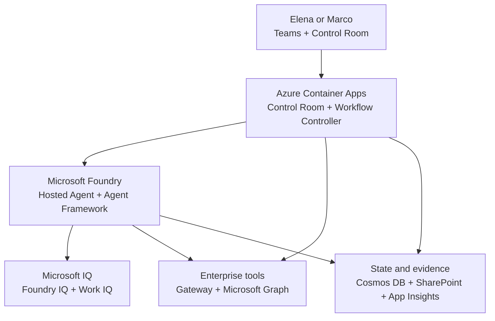
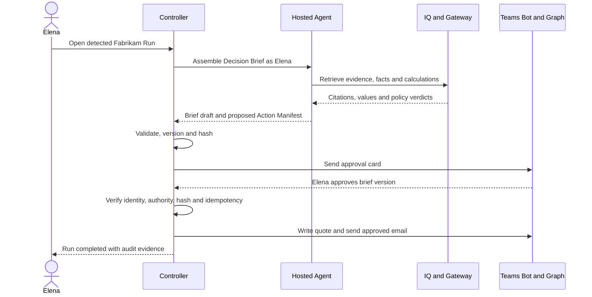

# InnexQ Implementation Blueprint

**Version:** 0.1  
**Date:** 2026-08-15  
**Status:** Build contract  
**Scenario dependency:** `INNEXQ-SCENARIO-V0.2.md`  
**Executive Challenge:** Hack for agents in the enterprise  

## 1. Build decision

The scenario is frozen. Existing projects provide sufficient evidence that the four platform capabilities are available, so separate technology spikes are not required.

We will start with one complete vertical slice:

> **Detect one Fabrikam renewal, assemble Microsoft IQ context, create a Proof-Carrying Decision Brief, obtain an authorized Teams approval, execute the approved SharePoint and mail actions, and record the Run.**

The first milestone is not a dashboard, corpus, agent, or infrastructure deployment in isolation. It is the smallest real end-to-end Renewal Run.

## 2. Architecture principles

1. **One agent, one workflow.** No multi-agent design unless a later requirement proves it necessary.
2. **The model proposes; code decides what is executable.** The agent never owns authorization or workflow state.
3. **Microsoft IQ provides context, not transaction truth.** Foundry IQ and Work IQ supply grounded evidence; deterministic tools supply amounts, dates, margins, assets, and authority limits.
4. **Approval binds to an immutable version.** An approval applies to a specific Decision Brief hash and Action Manifest. Any edit creates a new version and invalidates the old approval.
5. **Read and write authority are separated.** Retrieval cannot silently become execution.
6. **Every operation is idempotent.** Repeated callbacks or retries cannot create duplicate quotes or emails.
7. **The demo path is the production-shaped path.** No hidden manual backdoor is used to make the video work.
8. **Accessibility and observability are acceptance criteria, not final polish.**

## 3. Logical architecture



### Responsibility boundary

| Component | Owns | Must not own |
|---|---|---|
| Control Room | Human experience, evidence inspection, Run status, accessibility | Commercial calculation or authorization decisions |
| Workflow Controller | State machine, idempotency, approval validation, action execution | Generative reasoning |
| Hosted Agent | Retrieval planning, evidence synthesis, option explanation, draft creation | Persistent workflow authority or direct customer contact |
| Foundry IQ | Durable Company IQ retrieval, citations, permission enforcement | Current transaction values or writes |
| Work IQ | Delegated, recent Microsoft 365 work context | Pricing, margins, approval limits or autonomous writes |
| Gateway | Contract register, asset/service facts, pricing and authority checks | Free-form policy interpretation |
| Microsoft 365 action executor | Approved Teams status, SharePoint and mail operations | Deciding whether an action should occur |
| State store | Run state, versions, events, idempotency records | Source documents that belong in SharePoint |

## 4. Deployment topology

### Azure Container Apps environment

Deploy two application components initially:

1. **`innexq-web`**
   - React + TypeScript + Fluent UI.
   - External HTTPS ingress.
   - Microsoft Entra ID user authentication.
   - Control Room, Run timeline, Decision Brief and evidence views.

2. **`innexq-api`**
   - Python + FastAPI.
   - External ingress protected by Entra ID for the web client and approval callback; sensitive execution endpoints are internal-only.
   - Owns state transitions, approval validation, Graph execution, audit events and agent invocation.
   - Contains the deterministic Gateway as an internal module for the MVP. Split it into a separate internal Container App only if isolation or independent scaling becomes necessary.

### Microsoft Foundry

3. **`innexq-agent`**
   - One Foundry Hosted Agent built with Microsoft Agent Framework.
   - Strict structured input and output contracts.
   - Uses Foundry IQ, Work IQ and read-only Gateway tools.
   - Returns a Decision Brief proposal and proposed Action Manifest.
   - Has no direct mail-send or SharePoint-write tool.

4. **`contoso-company-iq`**
   - Foundry IQ knowledge base.
   - SharePoint and Azure Blob knowledge sources.
   - Permission-aware retrieval and citations.

### Supporting Azure services

| Resource | Purpose |
|---|---|
| Azure Cosmos DB serverless | Run state, append-only Run Events, brief versions, approvals, idempotency keys |
| Azure Storage | Seed fixtures, generated artifacts before approved publication, optional exports |
| Azure Key Vault | Any unavoidable secrets; managed identity remains the default |
| Application Insights + Log Analytics | Distributed traces, errors, latency, tool and action telemetry |
| Azure Container Registry | Web/API images and Hosted Agent image |
| Microsoft Entra ID | User authentication, managed identities, OBO flow and RBAC |
| Azure Bot Service / Teams app | Adaptive Card delivery, authenticated submit actions and approval callback |
| Microsoft Graph | SharePoint output and approved customer email |

No Service Bus, Logic Apps, Power Automate, APIM, Fabric IQ or Kubernetes is required for the MVP.

## 5. Identity and authorization model

### User identity

- Elena or Marco signs in to the Control Room using Microsoft Entra ID.
- The signed-in identity is used for permission-aware Foundry IQ and Work IQ retrieval through OBO/delegated authorization.
- The workflow records the actor object ID, tenant ID and assigned scenario role; it does not trust a role supplied by the browser.

### Work IQ timing

An automated scan can create a `DETECTED` Run without user context. Work IQ enrichment begins when Elena claims or opens the Run under her delegated identity. This avoids pretending that a background service has Elena's personal Microsoft 365 context.

### Workload identities

- `innexq-api` uses a managed identity for Cosmos DB, Storage, Key Vault, Foundry endpoint invocation and approved Graph application operations.
- The Hosted Agent receives its own Foundry-managed Entra identity.
- The Hosted Agent can read approved knowledge/tool surfaces but cannot execute external customer actions.
- The Graph executor checks the stored approval and Action Manifest before using any write permission.

### Authorization rule

```text
Executable =
  valid_state
  AND approved_brief_hash == current_brief_hash
  AND approver_has_required_authority
  AND action_manifest_is_allowlisted
  AND idempotency_key_not_completed
```

If any condition is false, execution is denied and a Run Event is written.

## 6. End-to-end sequence



## 7. State machine

```text
DETECTED
  -> CONTEXT_ASSEMBLING
  -> CONTEXT_ASSEMBLED
  -> POLICY_VERIFIED
  -> AWAITING_APPROVAL
  -> ESCALATED               (only when required)
  -> APPROVED
  -> EXECUTING
  -> EXECUTED

Any pre-approval state -> EVIDENCE_HOLD
AWAITING_APPROVAL or ESCALATED -> CLOSED_REJECTED
EXECUTING -> EXECUTION_FAILED -> EXECUTING (controlled retry)
```

Every transition is performed by the Controller and creates an append-only Run Event. The agent can recommend a transition reason but cannot directly mutate state.

## 8. Core domain contracts

All contracts are versioned JSON schemas shared by the API, agent and UI.

### Run

| Field | Meaning |
|---|---|
| `run_id` | Immutable UUID for one contract renewal attempt |
| `contract_id` | Authoritative contract identifier |
| `state` | Current state-machine value |
| `owner_user_id` | Elena or the account owner who claimed the Run |
| `current_brief_version` | Latest Decision Brief version |
| `current_brief_hash` | SHA-256 of canonical brief + Action Manifest |
| `created_at`, `updated_at` | UTC timestamps |
| `correlation_id` | Shared trace identifier across controller, agent and tools |

### Evidence Item

| Field | Meaning |
|---|---|
| `evidence_id` | Stable item identifier |
| `source_kind` | `foundry_iq`, `work_iq` or `tool` |
| `source_name` | Human-readable source/tool name |
| `source_locator` | Safe reference to document, message or tool result |
| `excerpt` | Minimal supporting text or normalized fact |
| `retrieved_at` | UTC retrieval timestamp |
| `actor_context` | Identity under which retrieval occurred |
| `supports_claim_ids` | Material claims supported by this item |
| `classification` | Scenario sensitivity marker |

### Proof-Carrying Decision Brief

| Section | Content |
|---|---|
| Recommendation | Proposed term, SLA and commercial option |
| Alternatives | Other permitted options and required authority |
| Material claims | Claim IDs, text and linked Evidence Items |
| Calculations | Deterministic tool inputs, outputs and version |
| Policy checks | Rule, verdict, evidence and authority requirement |
| Evidence gaps | Missing, stale, conflicting or inaccessible inputs |
| Action Manifest | Exact post-approval actions and parameters |
| Presentation | Plain-language summary and approved customer-language draft |

### Approval Decision

| Field | Meaning |
|---|---|
| `decision_id` | Immutable approval event ID |
| `run_id` | Associated Run |
| `brief_version`, `brief_hash` | Exact approved artifact |
| `actor_user_id` | Verified approver identity |
| `decision` | `approve`, `reject`, `edit` or `escalate` |
| `authority_result` | Deterministic authority check |
| `submitted_at` | UTC timestamp |
| `comment` | Optional human rationale |

### Action Manifest

Only allowlisted actions are supported:

- `sharepoint.create_file`
- `graph.send_mail`
- `teams.send_status`

Each action includes normalized parameters, an artifact hash and an idempotency key. The agent cannot invent a new action type.

## 9. API surface

| Method and route | Purpose |
|---|---|
| `POST /api/runs/detect` | Demo/manual detector for an eligible contract |
| `GET /api/runs` | List Runs visible to the signed-in user |
| `GET /api/runs/{run_id}` | Run, brief, evidence and current status |
| `POST /api/runs/{run_id}/claim` | Bind the Run to the signed-in account manager |
| `POST /api/runs/{run_id}/assemble` | Invoke the Hosted Agent and validate its structured output |
| `POST /api/runs/{run_id}/request-approval` | Version/hash the brief and issue the Teams card |
| `POST /api/approvals/callback` | Validate the Teams/Bot response and transition state |
| `POST /internal/runs/{run_id}/execute` | Internal-only approved action executor |
| `GET /api/runs/{run_id}/events` | Ordered Run Log |
| `POST /api/demo/reset` | Authorized, non-production reset of synthetic demo state |

State-changing endpoints require idempotency keys and optimistic concurrency.

## 10. Repository structure

```text
innexq/
├── .github/
│   └── workflows/                 # CI, security and deployment checks
├── docs/
│   ├── scenario/                  # Frozen scenario and vocabulary
│   ├── architecture/              # Diagrams and service contracts
│   ├── adr/                       # Architecture Decision Records
│   ├── security/                  # Threat model and permissions
│   └── demo/                      # Two-minute script and reset guide
├── infra/
│   ├── modules/                   # Terraform modules
│   ├── environments/              # dev/demo tfvars without secrets
│   └── main.tf
├── src/
│   ├── web/                       # React, TypeScript, Fluent UI
│   ├── api/                       # FastAPI workflow controller
│   ├── agent/                     # Microsoft Agent Framework Hosted Agent
│   ├── gateway/                   # Deterministic domain tools
│   └── contracts/                 # Versioned JSON schemas/models
├── corpus/
│   ├── sharepoint/                # Documents loaded to SharePoint
│   ├── blob/                      # Stable reference documents
│   ├── m365-seed/                 # Mail/meeting seed definitions
│   └── fixtures/                  # Contract and service test data
├── tests/
│   ├── unit/
│   ├── integration/
│   ├── retrieval/
│   ├── safety/
│   ├── e2e/
│   └── demo/
├── scripts/                       # Seed, reset, validate and smoke scripts
├── azure.yaml                     # azd orchestration
├── AGENTS.md                      # Codex build instructions
├── README.md
└── SECURITY.md
```

## 11. Initial ADRs

Create these before implementation choices spread through the codebase:

| ADR | Decision |
|---|---|
| ADR-001 | One Hosted Agent plus deterministic workflow controller; no multi-agent topology |
| ADR-002 | Foundry IQ for durable knowledge; Work IQ for live delegated work context |
| ADR-003 | Gateway facts and calculations remain authoritative over model output |
| ADR-004 | Approval binds to Decision Brief and Action Manifest hash |
| ADR-005 | Container Apps hosts experience/controller; Foundry Agent Service hosts agent code |
| ADR-006 | Cosmos DB event-oriented Run state with idempotent transitions |
| ADR-007 | Graph mutations isolated behind the approved executor |
| ADR-008 | Fabric IQ and M365 Copilot publication excluded from MVP |

## 12. Phased implementation plan

### Phase 0 - Repository and contracts

**Goal:** Establish a safe skeleton that prevents architecture drift.

- Create repository structure, `azure.yaml`, Terraform foundation and CI.
- Add scenario and ADRs.
- Define JSON schemas for Run, Evidence Item, Decision Brief, Approval and Action Manifest.
- Implement state transition rules and canonical hashing library.
- Add synthetic Fabrikam contract/service fixtures.

**Exit criteria:** State-machine and hash tests pass locally; CI runs without Azure credentials; no secrets exist in the repository.

### Phase 1 - First vertical slice

**Goal:** One complete but visually minimal Renewal Run.

- Deploy `innexq-api`, Cosmos DB and Application Insights.
- Deploy a minimal Hosted Agent.
- Create the minimum Foundry IQ corpus and knowledge base.
- Implement one pricing/authority tool.
- Generate one structured Decision Brief.
- Use a basic Teams approval card.
- On approval, create a SharePoint file and send a test email.
- Persist every Run Event.

**Exit criteria:** The complete flow works three times from reset without code changes or manual data repair.

### Phase 2 - Hero exception and Work IQ

**Goal:** Make the scenario intelligent and distinctive.

- Seed the 12% discount request and three-year term in Microsoft 365.
- Add Work IQ delegated retrieval.
- Implement the 8% authority rule and 12% escalation path.
- Add deterministic service-history and margin calculations.
- Add Evidence Hold for missing/conflicting sources.
- Bind approval to the current brief hash.

**Exit criteria:** Elena can approve the 8% option; the 12% option routes to Marco; a tampered or stale brief cannot execute.

### Phase 3 - Control Room and inclusion

**Goal:** Make reasoning, evidence and human control understandable in seconds.

- Build Run list, state timeline and Decision Brief views.
- Add plain-language/evidence modes.
- Add citations, policy verdicts, calculation provenance and intended actions.
- Implement keyboard navigation, visible focus, semantic labels and WCAG 2.2 AA colors.
- Add bilingual English/Swedish customer preview.
- Add outcome metrics without invented production claims.

**Exit criteria:** A first-time viewer can identify the current state, the policy conflict, the approver and the intended actions without verbal explanation.

### Phase 4 - Reliability, security and evaluation

**Goal:** Turn the prototype into a trustworthy, repeatable demonstration.

- Add retrieval golden tests and material-claim citation checks.
- Add authorization, tamper, duplicate-callback and replay tests.
- Add distributed tracing and safe telemetry redaction.
- Add controlled retries for external operations.
- Implement demo seed/reset and environment health check.
- Run threat-model review against action bypass and cross-user evidence leakage.

**Exit criteria:** Five consecutive hero Runs succeed; every negative test produces the expected safe outcome; no duplicate external action occurs.

### Phase 5 - Submission

**Goal:** Optimize the proof, not add product scope.

- Freeze features.
- Capture clean architecture and outcome visuals.
- Record the two-minute video from the real system.
- Finalize project description using the Executive Challenge language.
- Verify citations, permissions, fictional-data disclosure and public-content boundaries.
- Upload before the deadline with buffer for a failed upload or re-render.

**Exit criteria:** Submission page contains the final description and a video no longer than two minutes; the demo environment remains live and replayable.

## 13. Delivery calendar

| Window | Target |
|---|---|
| Aug 15-20 | Phase 0 complete |
| Aug 21-28 | Phase 1 complete: first end-to-end Run |
| Aug 29-Sep 5 | Phase 2 complete: Work IQ and exception path |
| Sep 6-11 | Phase 3 complete: Control Room and accessibility |
| Sep 12-16 | Phase 4 complete: reliability and evaluations |
| Sep 17-18 | Feature freeze and final demo rehearsal |
| Sep 19-20 | Record, edit and validate submission video |
| Sep 21 | Upload and submit with buffer before 11:59 PM Pacific |

## 14. Test matrix

| Test | Expected result |
|---|---|
| Fabrikam 8% option | Elena can approve; one file and one email are created |
| Fabrikam 12% option | Elena cannot execute; Run escalates to Marco |
| Missing pricing policy | `EVIDENCE_HOLD`; no approval request or write |
| Conflicting policy versions | Conflict visible; `EVIDENCE_HOLD` until resolved |
| Restricted source | Source content does not leak; gap is reported safely |
| Tampered Decision Brief | Hash mismatch; approval invalidated; execution denied |
| Duplicate approval callback | One successful execution; later callbacks are no-ops with audit events |
| Northwind not expiring | No Run created |
| Graph transient failure | `EXECUTION_FAILED`; controlled retry does not duplicate completed actions |
| Rejected approval | `CLOSED_REJECTED`; no SharePoint or mail write |

## 15. Observability contract

Every Run uses the same `correlation_id` across:

- Controller request and state transitions.
- Hosted Agent invocation.
- Foundry IQ and Work IQ retrieval calls.
- Gateway tool calls.
- Approval request and callback.
- SharePoint and mail actions.

Required dashboard signals:

- Runs by state and outcome.
- Median time per state.
- Evidence Hold count and reason.
- Citation coverage.
- Approval and escalation count.
- External action success/failure.
- Duplicate action prevented.

Prompts, retrieved content and email bodies must not be written indiscriminately to telemetry. Log identifiers, outcomes, hashes and safe summaries.

## 16. Demo reliability plan

- Maintain a dedicated synthetic demo environment.
- Use a deterministic seed package for SharePoint, Blob, contract data and Microsoft 365 messages.
- Provide one command to validate prerequisites and one authorized command to reset demo state.
- Tag generated files and messages with the Run ID.
- Pre-warm the visible path before recording without bypassing any workflow step.
- Keep a recorded backup of the working demo, but submit a video showing the real system.
- Freeze infrastructure and corpus changes at least 48 hours before recording.

## 17. Definition of done

InnexQ MVP is complete when:

1. A real Fabrikam Run moves from detection to execution through the defined state machine.
2. Foundry IQ supplies cited, permission-aware policy and contract evidence.
3. Work IQ supplies the delegated 12% request and three-year commitment.
4. All financial and authority results come from deterministic tools.
5. The 8% and 12% paths enforce different approval authority.
6. An approval is cryptographically bound to the current Decision Brief and Action Manifest.
7. Only approved actions write to SharePoint or send mail.
8. The full Run is replayable through the event history and distributed trace.
9. The Control Room meets the defined accessibility acceptance criteria.
10. The hero flow succeeds five consecutive times after reset.
11. The complete submission story fits inside two minutes.

## 18. Working model: Kostas, ChatGPT and Codex

### Kostas

- Owns product decisions, Azure/M365 access, resource ownership and final acceptance.
- Confirms the demo tenant data, personas and customer-facing narrative.
- Runs the deployed flow and records the final submission.

### ChatGPT

- Maintains the canonical scenario, architecture decisions, corpus design, evaluation cases, demo narrative and review criteria.
- Reviews architectural changes for scope drift, judging alignment and technical credibility.
- Produces the next Codex task only after the preceding acceptance criteria are satisfied.

### Codex

- Implements repository, infrastructure, services, tests and documentation against this build contract.
- Makes small, verifiable changes and reports evidence for each exit criterion.
- Must not add services, agents, workflows or frameworks outside the frozen scope without an ADR and explicit approval.

## 19. First Codex assignment

Codex should begin with **Phase 0 only**:

1. Create the repository structure from section 10.
2. Add the scenario and this blueprint under `docs/`.
3. Create ADR-001 through ADR-008 as short decision records.
4. Define versioned domain models and JSON schemas.
5. Implement the workflow transition guard and canonical brief hashing as a framework-independent Python package.
6. Add unit tests for valid/invalid transitions, brief versioning, hash changes and approval invalidation.
7. Create minimal FastAPI health and readiness endpoints.
8. Add CI for formatting, linting, type checking, unit tests and secret scanning.
9. Add `azure.yaml` and Terraform placeholders without deploying resources.
10. Stop and present the repository tree, test results and open decisions for review.

### Phase 0 acceptance command set

Codex should expose a small documented command set equivalent to:

```bash
make format-check
make lint
make type-check
make test-unit
make security-check
make verify
```

The exact task runner may differ, but one aggregate verification command is mandatory.

## 20. Official implementation references

- [Microsoft Foundry Agent Service](https://learn.microsoft.com/en-us/azure/foundry/agents/overview)
- [Hosted Agents in Foundry Agent Service](https://learn.microsoft.com/en-us/azure/foundry/agents/concepts/hosted-agents)
- [Microsoft Agent Framework](https://learn.microsoft.com/en-us/agent-framework/overview/)
- [Foundry IQ](https://learn.microsoft.com/en-us/azure/foundry/agents/concepts/what-is-foundry-iq)
- [Connect an agent to Foundry IQ](https://learn.microsoft.com/en-us/azure/foundry/agents/how-to/foundry-iq-connect)
- [Work IQ](https://learn.microsoft.com/en-us/microsoft-365/copilot/extensibility/work-iq/)
- [Publish a Hosted Agent through Microsoft Agent 365](https://learn.microsoft.com/en-us/azure/foundry/agents/how-to/agent-365)
- [Microsoft Graph documentation](https://learn.microsoft.com/en-us/graph/overview)
- [Adaptive Cards for Microsoft Teams bots](https://learn.microsoft.com/en-us/microsoftteams/platform/bots/how-to/conversations/conversation-messages#send-an-adaptive-card)

---

**Build rule:** when forced to choose, prefer a smaller complete and trustworthy workflow over a broader architecture or more impressive feature list.

